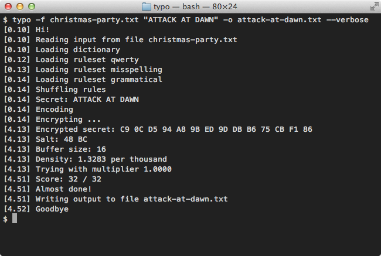

##### Version 0.3.6

This is a tool for typo-based text steganography. It lets you hide secret
information in typographical errors.

### Background

Why steganography?

Because [this][2].

[![Security][3]][2]

[2]:http://xkcd.com/538/ "xkcd: Security"
[3]:security.png

### Installation

Install [Node.js][1].

Then run the following command:

    npm install -g typo-steganography

Verify the installation:

    typo --version

[1]:https://nodejs.org/

### Usage

To encode a secret:

    typo '1984' message.txt > message.typo.txt

Where "1984" is the secret.

To decode a secret:

    typo -d -g message.txt < message.typo.txt

Where message.txt is the original file.

It should be possible to reconstruct message.txt from message.typo.txt simply
by correcting the spelling errors.

See `typo --help` for more.

### Issues

You can report and track any issues here:

https://github.com/mjethani/typo/issues

### License

Please see the LICENSE file included in the package.

---
Copyright (c) 2015 Manish Jethani

